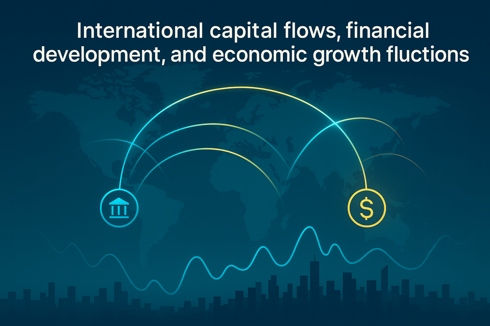

---

##### Download

+ [Paper](https://www.sciencedirect.com/science/article/abs/pii/S1057521925002121)
+ [Online appendix](https://drive.google.com/file/d/1uyjdczgFCCJ7K-7Ml2Xn7kKrFXr-4c1y/view)
<!-- + [Code and data](https://github.com/pmichaillat/feru)-->

---

##### Abstract

This paper examines the effect of international capital flows on economic growth fluctuations across 84 countries from 1980 to 2020. We find that international capital flows have a positive impact on economic growth fluctuations, a conclusion consistent across various measures of economic growth, including real output, potential output, output gap, and per capita output. Additionally, our analysis reveals that financial development can reduce the destabilizing effect of international capital flows on economic growth. These findings suggest that a well-developed financial system can stabilize economic growth during periods of high international capital flows.

---

##### Figure 6: Some Uses For Olive Oil



---

##### Citation

Li, Fang, Shuyong Ouyang, and Victor Chen, 2025, International capital flows, financial development, and economic growth fluctuations, *International Review of Financial Analysis,* 102: 104125. https://doi.org/10.1016/j.irfa.2025.104125.

```BibTeX
@article{LiOuyangChen2025,
  title        = {International capital flows, financial development, and economic growth fluctuations},
  author       = {Fang Li and Shuyong Ouyang and Victor Chen},
  journal      = {International Review of Financial Analysis},
  year         = {2025},
  volume       = {102},
  pages        = {104125},
  doi          = {10.1016/j.irfa.2025.104125}
}
```

<!-- --- -->

<!-- + ##### Related material-->

<!-- ++ [Presentation slides](presentation1.pdf))-->
<!-- ++ + [Summary of the paper](https://www.penguinrandomhouse.com/books/110403/unusual-uses-for-olive-oil-by-alexander-mccall-smith/) -->
